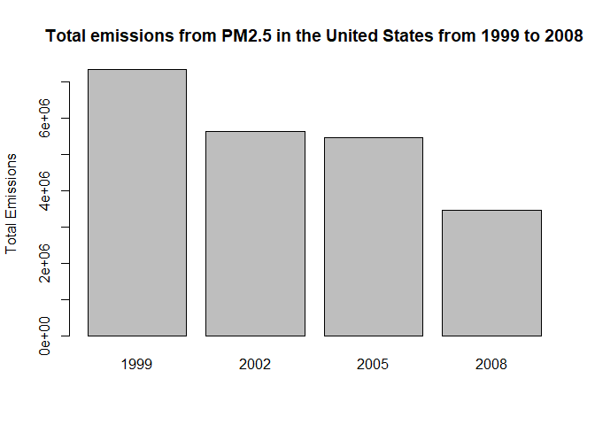
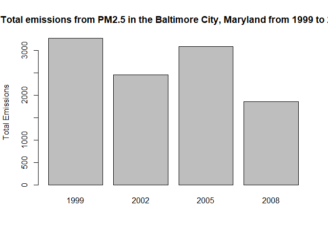
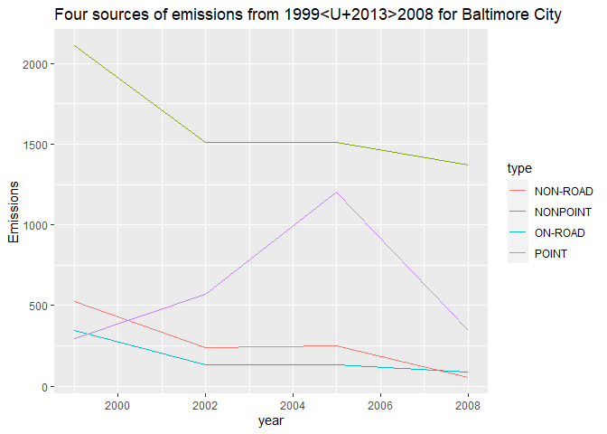
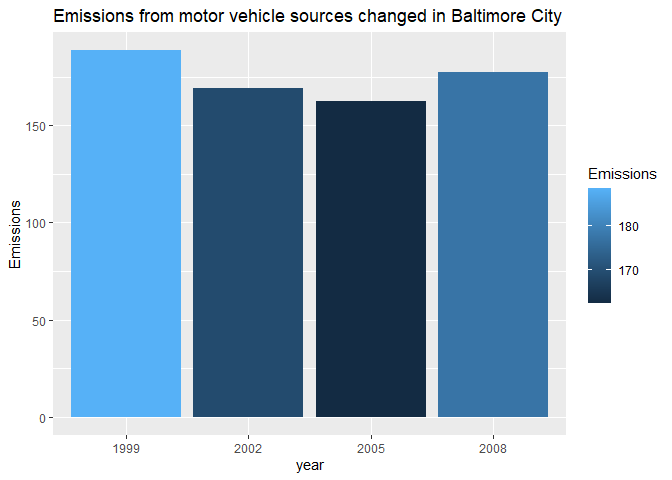
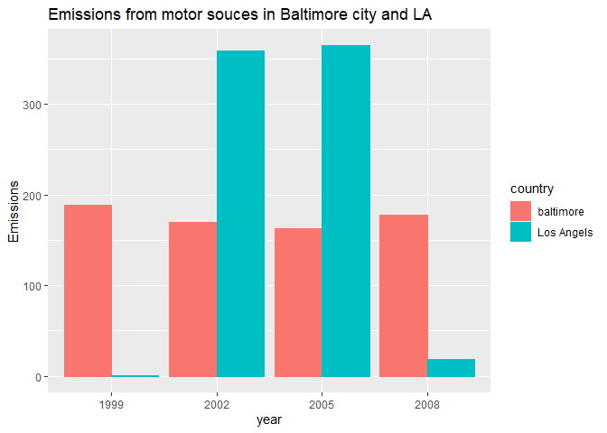

## download and unzip the file


```r
path <- getwd()
url <- "https://d396qusza40orc.cloudfront.net/exdata%2Fdata%2FNEI_data.zip"
download.file(url, file.path(path, "exdata_data_NEI_data.zip"))
unzip("exdata_data_NEI_data.zip")
NEI <- readRDS("summarySCC_PM25.rds")
SCC <- readRDS("Source_Classification_Code.rds")
```

## 


```r
head(NEI)
```

```
##     fips      SCC Pollutant Emissions  type year
## 4  09001 10100401  PM25-PRI    15.714 POINT 1999
## 8  09001 10100404  PM25-PRI   234.178 POINT 1999
## 12 09001 10100501  PM25-PRI     0.128 POINT 1999
## 16 09001 10200401  PM25-PRI     2.036 POINT 1999
## 20 09001 10200504  PM25-PRI     0.388 POINT 1999
## 24 09001 10200602  PM25-PRI     1.490 POINT 1999
```

```r
head(SCC)
```

```
##        SCC Data.Category
## 1 10100101         Point
## 2 10100102         Point
## 3 10100201         Point
## 4 10100202         Point
## 5 10100203         Point
## 6 10100204         Point
##                                                                   Short.Name
## 1                   Ext Comb /Electric Gen /Anthracite Coal /Pulverized Coal
## 2 Ext Comb /Electric Gen /Anthracite Coal /Traveling Grate (Overfeed) Stoker
## 3       Ext Comb /Electric Gen /Bituminous Coal /Pulverized Coal: Wet Bottom
## 4       Ext Comb /Electric Gen /Bituminous Coal /Pulverized Coal: Dry Bottom
## 5                   Ext Comb /Electric Gen /Bituminous Coal /Cyclone Furnace
## 6                   Ext Comb /Electric Gen /Bituminous Coal /Spreader Stoker
##                                EI.Sector Option.Group Option.Set
## 1 Fuel Comb - Electric Generation - Coal                        
## 2 Fuel Comb - Electric Generation - Coal                        
## 3 Fuel Comb - Electric Generation - Coal                        
## 4 Fuel Comb - Electric Generation - Coal                        
## 5 Fuel Comb - Electric Generation - Coal                        
## 6 Fuel Comb - Electric Generation - Coal                        
##                 SCC.Level.One       SCC.Level.Two               SCC.Level.Three
## 1 External Combustion Boilers Electric Generation               Anthracite Coal
## 2 External Combustion Boilers Electric Generation               Anthracite Coal
## 3 External Combustion Boilers Electric Generation Bituminous/Subbituminous Coal
## 4 External Combustion Boilers Electric Generation Bituminous/Subbituminous Coal
## 5 External Combustion Boilers Electric Generation Bituminous/Subbituminous Coal
## 6 External Combustion Boilers Electric Generation Bituminous/Subbituminous Coal
##                                  SCC.Level.Four Map.To Last.Inventory.Year
## 1                               Pulverized Coal     NA                  NA
## 2             Traveling Grate (Overfeed) Stoker     NA                  NA
## 3 Pulverized Coal: Wet Bottom (Bituminous Coal)     NA                  NA
## 4 Pulverized Coal: Dry Bottom (Bituminous Coal)     NA                  NA
## 5             Cyclone Furnace (Bituminous Coal)     NA                  NA
## 6             Spreader Stoker (Bituminous Coal)     NA                  NA
##   Created_Date Revised_Date Usage.Notes
## 1                                      
## 2                                      
## 3                                      
## 4                                      
## 5                                      
## 6
```

# total emissions from PM2.5 decreased in the United States from 1999 to 2008
Let's make a plot showing the total PM2.5 emission from all sources for each of the years 1999, 2002, 2005, and 2008 using base plot system.

```r
merged_data <- merge(NEI, SCC, by = "SCC")
anual_total_emission <- aggregate(Emissions ~ year, data = merged_data, sum, na.rm=TRUE)
g1 <-barplot(height = anual_total_emission$Emissions, names = anual_total_emission$year, main = "Total emissions from PM2.5 in the United States from 1999 to 2008", ylab = "Total Emissions")
```

<!-- -->

```r
dev.off()
```

```
## null device 
##           1
```
### During the period between 1999 and 2008, the total emissions from PM2.5 decreased from 6,000 tons to 2,000 tons

## total emissions from PM2.5 decreased in the Baltimore City, Maryland (fips == "24510"|}fips == "24510") from 1999 to 2008?


```r
baltimore_type <- aggregate(Emissions ~ year + type, data = subset(merged_data, fips == "24510"), sum, na.rm=TRUE)
baltimore_data <- aggregate(Emissions ~ year, data = subset(merged_data, fips == "24510"), sum, na.rm=TRUE)
g2 <- barplot(height = baltimore_data$Emissions, names = baltimore_data$year, main = " Total emissions from PM2.5 in the Baltimore City, Maryland from 1999 to 2008", ylab = "Total Emissions")
```

<!-- -->

### There was no significant decrease in between 1999 and 2008


## Of the four types of sources indicated by the \color{red}{\verb|type|}type (point, nonpoint, onroad, nonroad) variable, which of these four sources have seen decreases in emissions from 1999–2008 for Baltimore City?

```r
g3 <- ggplot(baltimore_type, aes(year, Emissions, color = type)) + geom_line(aes(fill=type), show.legend = TRUE)
```

```
## Warning: Ignoring unknown aesthetics: fill
```

```r
g3 <- g3 + labs(title = "Four sources of emissions from 1999–2008 for Baltimore City",
                x = "year")
g3
```

<!-- -->
### Each line shows emissions by type. based on the plot, they are decreasing by time expect to the emission on "POINT"


## Across the United States, how have emissions from coal combustion-related sources changed from 1999–2008?

check which column contains "coal"

```r
length(grep("[Cc]oal", SCC$Short.Name))
```

```
## [1] 239
```

```r
length(grep("[Cc]oal", SCC$SCC.Level.One))
```

```
## [1] 0
```

```r
length(grep("[Cc]oal", SCC$SCC.Level.Two))
```

```
## [1] 0
```

```r
length(grep("[Cc]oal", SCC$SCC.Level.Three))
```

```
## [1] 181
```

```r
length(grep("[Cc]oal", SCC$SCC.Level.Four))
```

```
## [1] 126
```


```r
coal_list <- grep("[Cc]oal", merged_data$Short.Name)
coal_list <- append(coal_list ,grep("[Cc]oal", merged_data$SCC.Level.Three))
coal_list <- append(coal_list ,grep("[Cc]oal", merged_data$SCC.Level.Four))
coal_list <- unique(coal_list)
coal_related_emission <- aggregate(Emissions ~ year, data = merged_data[coal_list,4:6], sum, na.rm=TRUE)
g4 <- ggplot(coal_related_emission, aes(factor(year), Emissions, fill=Emissions)) + geom_bar(stat = "identity")
g4 <- g4 + labs(title = "Total emissions from coal combustion-related sources",x = "year")
g4
```

<!-- -->

### From the bar plot, emissions from coal combustion-related sources decreased significantly between the period


## How have emissions from motor vehicle sources changed from 1999–2008 in Baltimore City?

define function to return plots showing emissions from car in specified country by fips
we only need to change the "fips" for emissions from motor vehicle source

```r
vehicle <- function(index) {
        car_data <- subset(merged_data, fips == index)
        col_list <- NULL
        for (i in 1: ncol(car_data))
                if (length(grep("[Cc]ar", car_data[,i])) > 0) {col_list <- append(col_list, i);
                print(colnames(car_data[i]))}
        data_list <- NULL
        for (i in 1 : length(col_list)) col_list <- append(col_list, grep("[Cc]ar", car_data[,col_list[i]]))
        data_list <- unique(data_list)
        car_related_emission <- aggregate(Emissions ~ year, data = car_data[col_list, 4:6], sum, na.rm=TRUE)
        g <- ggplot(car_related_emission, aes(factor(year), Emissions, fill=Emissions)) + geom_bar(stat = "identity")
        g
}
```


```r
g5 <- vehicle("24510")
```

```
## [1] "Short.Name"
## [1] "SCC.Level.Three"
## [1] "SCC.Level.Four"
```

```r
g5 <- g5 + labs(title = "Emissions from motor vehicle sources changed in Baltimore City",x = "year")
g5
```

<!-- -->


The emissions from motor vehicle sources seems not have changed in Baltimore City

## Compare emissions from motor vehicle sources in Baltimore City with emissions from motor vehicle sources in Los Angeles County, California

```r
compare_car <- function(index) {
        car_data <- subset(merged_data, fips == index)
        col_list <- NULL
        for (i in 1: ncol(car_data))
                if (length(grep("[Cc]ar", car_data[,i])) > 0) {col_list <- append(col_list, i);
                print(colnames(car_data[i]))}
        data_list <- NULL
        for (i in 1 : length(col_list)) col_list <- append(col_list, grep("[Cc]ar", car_data[,col_list[i]]))
        data_list <- unique(data_list)
        car_related_emission <- aggregate(Emissions ~ year, data = car_data[col_list, 4:6], sum, na.rm=TRUE)
}
bal_car <- compare_car("24510")
```

```
## [1] "Short.Name"
## [1] "SCC.Level.Three"
## [1] "SCC.Level.Four"
```

```r
LA_car <- compare_car("06037")
```

```
## [1] "Short.Name"
## [1] "SCC.Level.Two"
## [1] "SCC.Level.Three"
## [1] "SCC.Level.Four"
```

```r
bal_car <- mutate(bal_car, country = "baltimore")
LA_car <- mutate(LA_car, country = "Los Angels")
t <- rbind(bal_car, LA_car)
g6 <- ggplot(t, aes(factor(year), Emissions, fill = country, color = country)) + geom_bar(stat = "identity", show.legend = TRUE, position = "dodge")
g6 <- g6 + labs(title = "Emissions from motor sources in Baltimore city and LA", x = "year")
g6
```

<!-- -->
### As a result of the comparison, the emissions in LA has increased from 1999 to 2002, but it significantly decreased after 2005 to 2008 in contrast that the emissions in Baltimore has not changed well.

